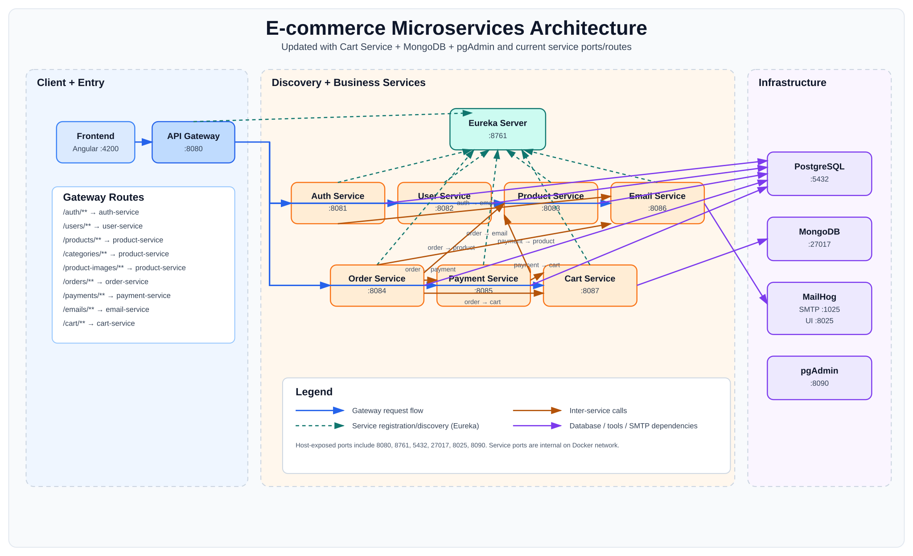

# E-commerce Microservices (Spring Boot + Eureka + Gateway)

## Services & Ports

### Host-exposed ports (Docker)
- api-gateway: http://localhost:8080
- eureka-server: http://localhost:8761
- postgres: localhost:5432 (optional for debugging)
- mailhog ui: http://localhost:8025

### Internal-only (Docker network)
- auth-service: 8081
- user-service: 8082
- product-service: 8083
- order-service: 8084

> Internal endpoints like `/internal/**` are NOT routed by the gateway.

---

## Profiles / URLs

### Local (run with `mvn spring-boot:run`)
Each service default `application.yml` uses:
- Eureka: `http://localhost:8761/eureka`
- Postgres: `localhost:5432/<db>`

### Docker
Compose sets:
- `SPRING_PROFILES_ACTIVE=docker`
- `EUREKA_URL=http://eureka-server:8761/eureka`
- `SPRING_DATASOURCE_URL=jdbc:postgresql://postgres:5432/<db>`
- Mail SMTP: `smtp.gmail.com:587` (configure `MAIL_USERNAME`, `MAIL_PASSWORD`, and optionally `MAIL_FROM`)

---

## Run with Docker Compose

From repo root:

```bash
docker compose up --build

```

## Architecture Diagram


